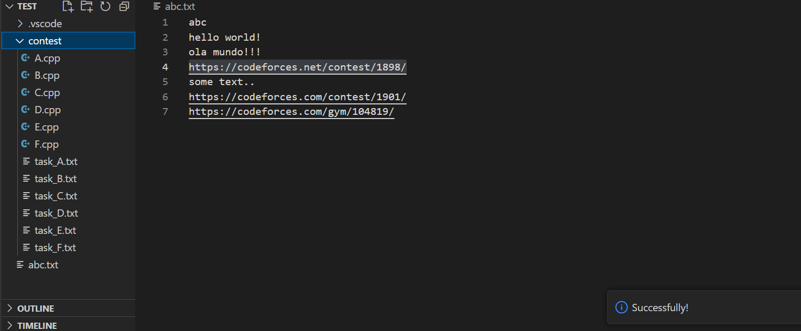
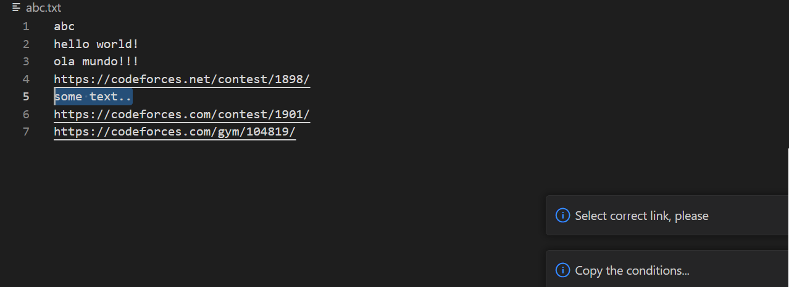

# CFplugin

* [General description](#general_description) 
* [Step-by-step instruction](#instruction)
* [Project modification history](#modification)

### <a id="general_description">General description</a>

The plugin allows you to make working with programming contests on the Codeforces platform more convenient. 

The plugin creates the directory **contest** with following structure: .txt files with task conditions and .cpp files with tests.

### <a id="instruction">Step-by-step instructions</a>

1 - Select a link to the Codeforces round.

2 - Enter Ctrl + Shift + 3 or Ctrl + Shift + P and search 'Codeforces round'.

If you selected correct link to the Codeforces round, there will be a directory **contest** with all tasks and success message. 

Otherwise, an error message will appear.

## <a id="modification">Project modification history</a>
| Commit hash    | Commit message (description)            |
| -------------- | --------------------------------------- |
| cb27e17        | Initial commit                          |
| d46cc18        | Update README.md                        |
| 0170d2a        | add: base structure                     |
| 03580f3        | add: Codeforces round parser            |
| aa58703        | add: run python script                  |
| 9a13714        | add: pass data between js and python    |
| 66f06c0        | add: keybinding                         |
| 238db69        | add: error messages                     |
| fbd718e        | fix: parsing                            |
| e50362e        | style: remove extra comments            |

### by Smirnova Svetlana, M3100